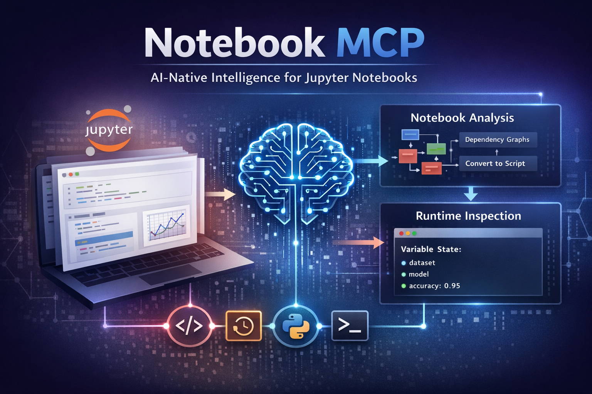

# Notebook MCP



AI-Native Intelligence Layer for Jupyter Notebooks using the Model Context Protocol (MCP)

Notebook MCP enables AI assistants (Cursor, Windsurf, Claude Desktop, etc.) to properly understand, analyze, and interact with `.ipynb` notebooks.

---

## ✨ Features

* Builds dependency graphs across notebook cells
* Detects stale and unexecuted cells
* Generates rerun plans automatically
* Provides focused context slices for LLM reasoning
* Converts notebooks into deterministic Python scripts
* Integrates with live Jupyter kernels
* Allows runtime execution and variable inspection

---

## 📦 Installation

```
npm install -g @akram1110/notebook-mcp
```

This CLI automatically installs the Python backend via PyPI.

---

## ⚙️ Requirements

* Python 3.10+
* pip
* Node.js 18+

---

## 🚀 Usage

Run MCP server:

```
notebook-mcp
```

---

## 🧠 MCP Tools Provided

### Notebook Analysis

* notebook_analyze
* notebook_context
* notebook_export_script
* notebook_state
* notebook_rerun_plan

### Jupyter Runtime

* jupyter_list_sessions
* jupyter_get_kernel
* jupyter_execute
* jupyter_inspect

---

## 🔌 Cursor MCP Configuration

```
{
  "mcpServers": {
    "notebook": {
      "command": "notebook-mcp"
    }
  }
}
```

---

## 🌍 Python Backend

Python package is available at:

[https://pypi.org/project/notebook-mcp/](https://pypi.org/project/notebook-mcp/)

---

## 💬 Feedback

Issues and contributions welcome on GitHub.
